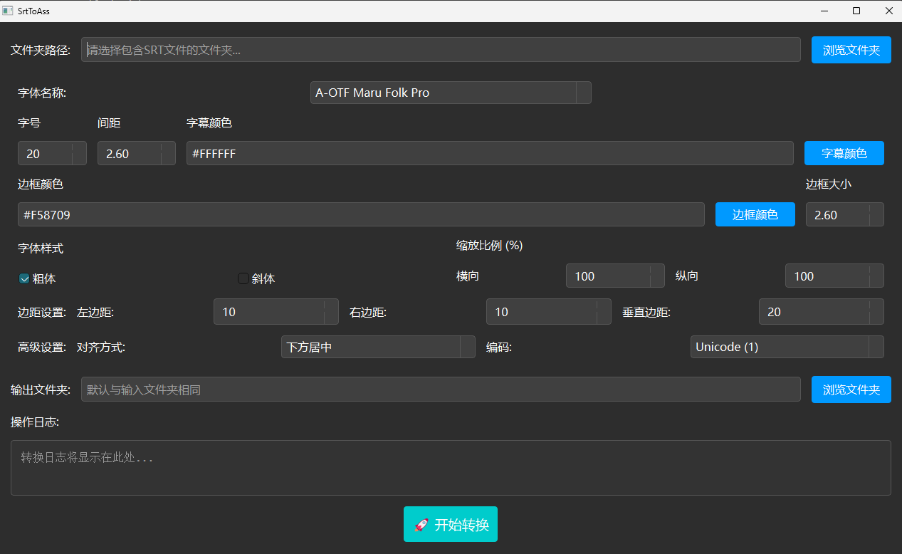

# SrtToASS

将Srt格式的字幕文件转为样式更加丰富的Ass文件，其中我已加入设置字体格式、大小、颜色、边框大小等一些简单的样式。
然后默认的样式是参考[VideoCaptioner](https://github.com/WEIFENG2333/VideoCaptioner)的“番剧可爱风样式”，在此十分感谢。

## 注意：
该软件的特色就是可以**批量**修改srt字幕文件为有样式的ass文件。

然后我把程序打包为exe可执行文件夹，上传到Github，可以直接使用。

## 开发原因
初衷是想要看中日双语视频，有时发现网上找的srt日语字幕基本没有样式。虽然ass样式字幕是存在的，但是这些字幕普遍较少，而且样式存在一定问题（比如并不是下方居中等），不如用srt字幕方便。所以我就想能不能把srt字幕转为ass字幕，并加入样式。

但是网上找的VideoCaptioner等开源软件基本只能一个一个处理，不太方便，剩下的可能是要付费的，最后没找到满足批量把srt格式文件转为自己想要的带样式的ass文件需求的软件，所以我就使用Python自己开发一个。

## 软件样式图：

## 联系
如果使用过程中有问题或者有新的需求，可以通过issue提交或者发邮件给[wei_xu_liu@163.com](wei_xu_liu@163.com)反馈意见，十分感谢。

## 发现的不足地方和替代解决方法（如有）
- 不能单个选择srt文件。
  
  **解决方法：** 可以新建一个文件夹，然后把srt文件放在文件夹。另外，后续的更新可能会解决
- 在不同的动漫中，处理后的日语ass字幕的大小可能会有所不同，所以字号需要自己调，比较麻烦。比如默认20的字幕在一些动漫中可能正常，但在其他动漫中就需要40才能达到这个大小。
  
  **解决方法：** 无，可能后续更新解决。
- 如果在PotPlayer中观看双语视频，建议点次字幕输出选择日语ass字幕，即“字幕->选择字幕->次要字幕->添加字幕”，这样样式基本都正常；但是如果直接选择“添加次字幕”就有可能出现样式异常问题，此问题在**简繁内封**动漫中普遍存在的。
  
  **解决方法：** 可以直接选择中文外挂字幕，基本能规避这个问题。

- 不能切换主题。
  
  **解决方法：** 无，因为我是初次使用PySide6，所以这个问题我目前不太会写多个主题切换的代码，如果学会了，后续更新就补上。

- 待续....

## 鸣谢
- [VideoCaptioner](https://github.com/WEIFENG2333/VideoCaptioner)
- [PySide6-Code-Tutorial教程](https://github.com/muziing/PySide6-Code-Tutorial)