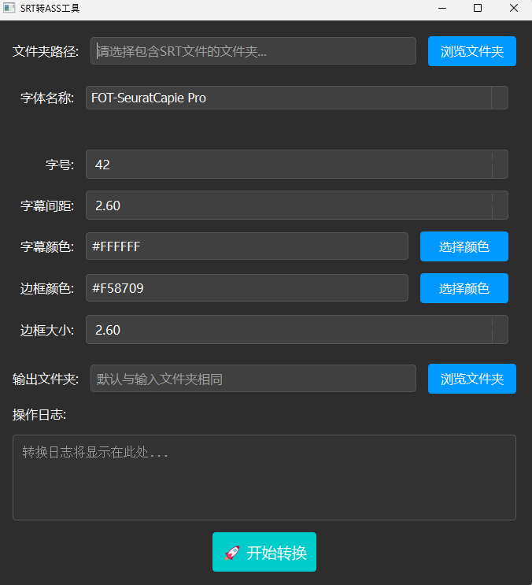

# SrtToASS

将Srt格式的字幕文件转为样式更加丰富的Ass文件，其中我已加入设置字体格式、大小、颜色、边框大小等一些简单的样式。
然后默认的样式是参考[VideoCaptioner](https://github.com/WEIFENG2333/VideoCaptioner)的“番剧可爱风样式”，在此十分感谢。

### 注意：
该软件的特色就是可以**批量**修改srt字幕文件为有样式的ass文件。

然后我把程序打包为exe可执行文件夹，上传到Github，可以直接使用。

### 开发原因
因为没找到满足批量把srt格式文件转为自己想要的带样式的ass文件需求的软件，而网上找的VideoCaptioner等开源软件基本只能一个一个处理，不太方便，剩下的可能是要付费的，所以我就Python自己开发一个。（有些工作是用DeepSeek辅助开发的）。

### 软件样式图：

### 联系
如果使用过程中有问题或者有新的需求，可以通过issue提交或者发邮件给[wei_xu_liu@163.com](wei_xu_liu@163.com)反馈意见，十分感谢。

## 鸣谢
- [VideoCaptioner](https://github.com/WEIFENG2333/VideoCaptioner)
- [DeepSeek](https://www.deepseek.com/)
- [PySide6-Code-Tutorial教程](https://github.com/muziing/PySide6-Code-Tutorial)